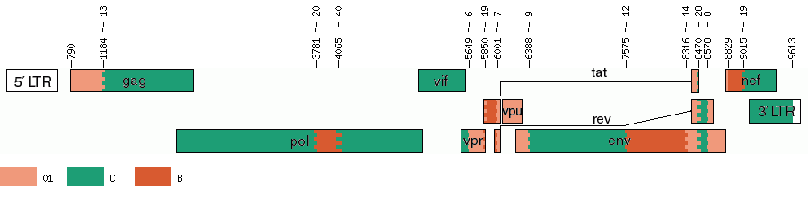
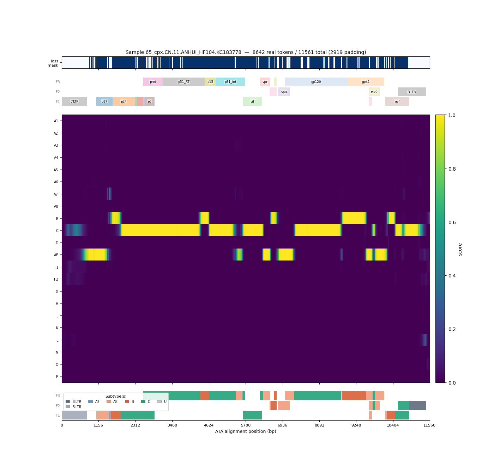
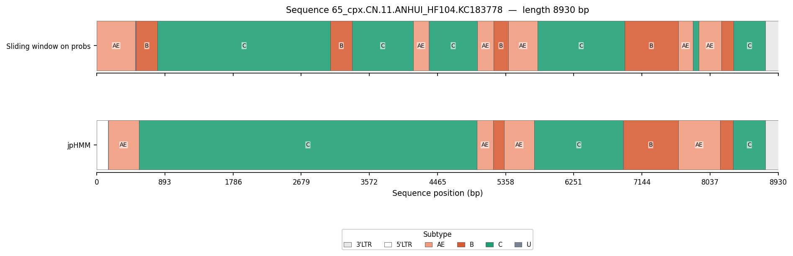

# sbtr: HIV-1 Deep Learning-based SuBTypeR


**sbtr** is a novel genomic language model tool designed for fine-grain HIV-1 subtyping per nucleotide position. By predicting subtypes at high spatial resolution, sbtr detects novel recombinant forms and identifies precise recombination breakpoints rapidly.

<br clear="left">

## How it works

sbtr processes input sequences through an automated end-to-end pipeline:
1. **Dealign & Align**: Input FASTA sequences or existing alignments are dealigned and aligned against an internal HIV-1 reference using MAFFT.
2. **Language Model Inference**: Aligned sequences pass through a pre-trained genomic language model.
3. **Subtype Classification**: Predictions are compared against model outputs from a reference bank of Circulating Recombinant Forms (CRFs) to generate final per-position and global subtype assignments.

---

## Installation & setup

sbtr runs inside isolated container environments (Docker or Apptainer/Singularity) to manage CUDA and MAFFT dependencies.

### 1. Retrieve the container

**Docker:**

```bash
docker pull ghcr.io/oanoufa/sbtr:latest
```

**Apptainer:**

```bash
apptainer pull sbtr.sif docker://ghcr.io/oanoufa/sbtr:latest
```

---

## Usage

> **Note:** A Hugging Face token must be specified (`HF_TOKEN`) to download model weights from InstaDeepAI/NTv3_650M_pre. This token must come from an account with access to the model repository. This can be done at this address [https://huggingface.co/InstadeepAI/NTv3_650M_pre](https://huggingface.co/InstadeepAI/NTv3_650M_pre).

### Running with Docker

```bash
docker run --rm --shm-size=2g \
  -e HF_TOKEN=hf_xxxxxx \
  -v /path/to/data/input:/data/in \
  -v /path/to/data/output:/data/out \
  sbtr \
  --seq /data/in/sequences.fasta \
  --mafft_bin mafft \
  --tag my_sequences \
  --out_dir /data/out \
  --wto r \
  --num_cpu ${N_WORKERS} \
  --gpu \
  --batch_size 8
```


### Running with Apptainer

```bash
apptainer run --nv \
  --env HF_TOKEN=hf_xxxxxx \
  --bind /path/to/tmp:/tmp \
  --bind /path/to/data/input:/data/in \
  --bind /path/to/data/output:/data/out \
  /pasteur/helix/projects/mPath/oanoufa/sbtr/sbtr.sif \
  --seq /data/in/sequences.fasta \
  --mafft_bin mafft \
  --tag my_sequences \
  --out_dir /data/out \
  --wto r \
  --num_cpu ${N_WORKERS} \
  --gpu \
  --batch_size 8
```

---

## Command line arguments

| Parameter | Type | Default | Description |
| :--- | :--- | :--- | :--- |
| `--seq` | `str` | *Required* | Path to input FASTA file or alignment. |
| `--out_dir` | `str` | `"./sbtr_output"` | Output directory destination. |
| `--tag` | `str` | `"sbtr"` | Text appended to generated output file names. |
| `--mafft_bin` | `str` | `"mafft"` | Path to MAFFT executable (assumed on `PATH`). |
| `--gpu` | `flag` | `False` | Enable CUDA GPU acceleration. |
| `--num_cpu` | `int` | `1` | Number of CPUs for concurrent processing. |
| `--batch_size` | `int` | `1` | Forward pass batch size (increase for GPU runs). |
| `--wto` | `str` | `""` | Optional outputs to write (see details below). |

### Output flags (`--wto`)
The tool always outputs `results_<tag>.csv` and `summary_<tag>.json`. You can request additional outputs by concatenating any combination of these letters to `--wto`:

* `f`: Generate plots/figures showing per-sequence predictions *(adds runtime)*.
* `r`: Output a region CSV containing `(start, end, subtype)` breakpoints.
* `p`: Export raw prediction scores as a NumPy (`.npy`) file.
* `a`: Save model attention masks.

*Example:* `--wto fr` outputs both the prediction figures and the genomic regions CSV.

---

## Outputs

* `results_<tag>.csv`: Final per-position subtype predictions.
* `summary_<tag>.json`: Run metadata and summary statistics.
* `regions_dealigned_<tag>.csv` *(optional)*: Genomic coordinates and assigned subtypes.
* `figures/` *(optional)*: Graphical visualisations of sequence subtype profiles.

---

## Example output

Below is an example run on `65_cpx.CN.11.ANHUI_HF104.KC183778`, a CRF65_cpx recombinant (subtypes 01_AE / B / C).

**1. Reference genome structure**
The known subtype composition of CRF65_cpx across the HIV-1 genome (`gag`, `pol`, `env`, accessory genes), used here as ground truth.



**2. Per-position subtype predictions**
sbtr's raw prediction scores for each HIV-1 subtype along the sequence, with gene annotations shown above the heatmap.



**3. Comparison with jpHMM**
sbtr's sliding-window subtype calls closely track the reference structure and recover breakpoints that jpHMM's coarser segmentation misses.

